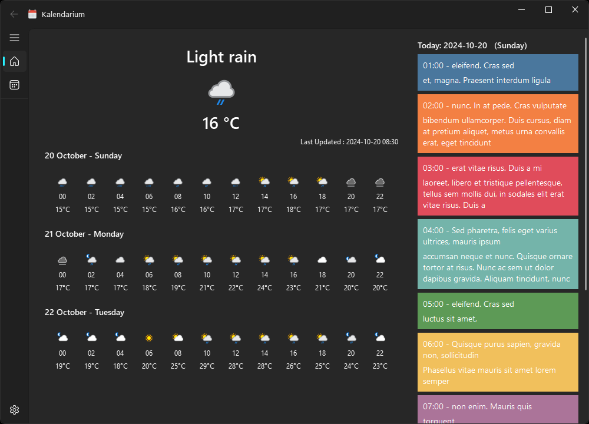
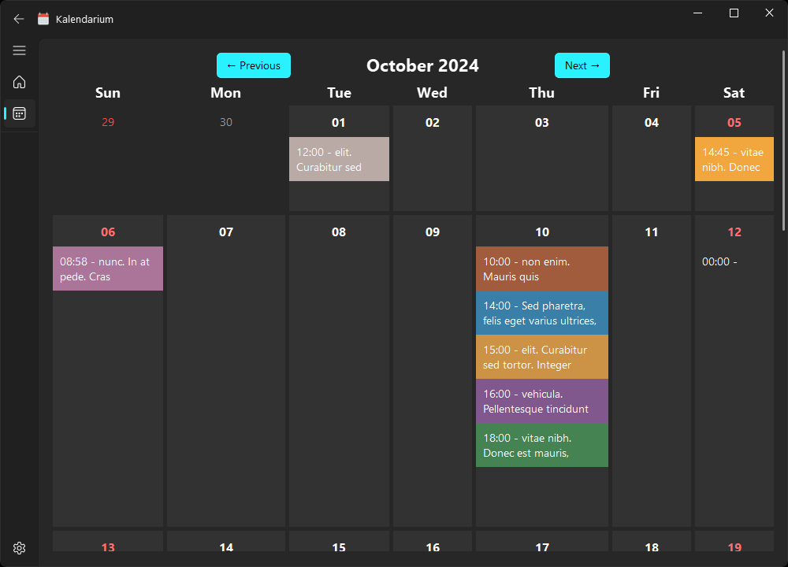
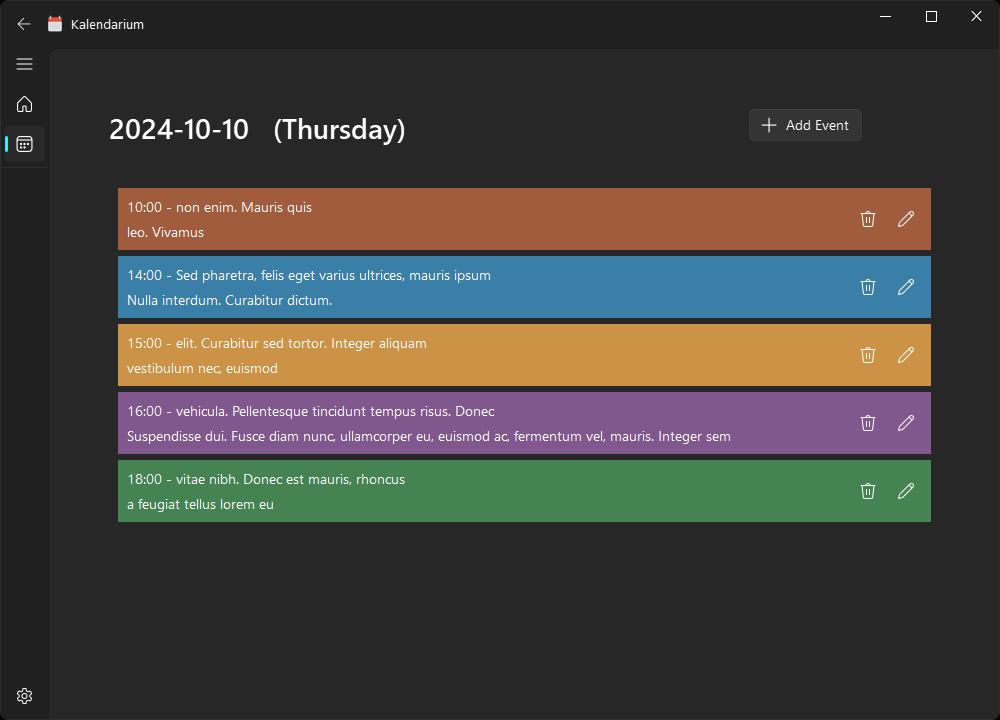
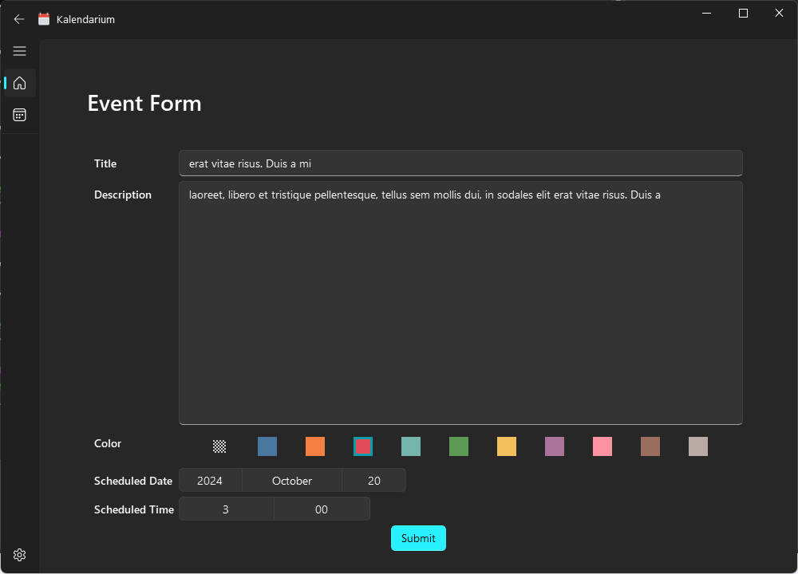
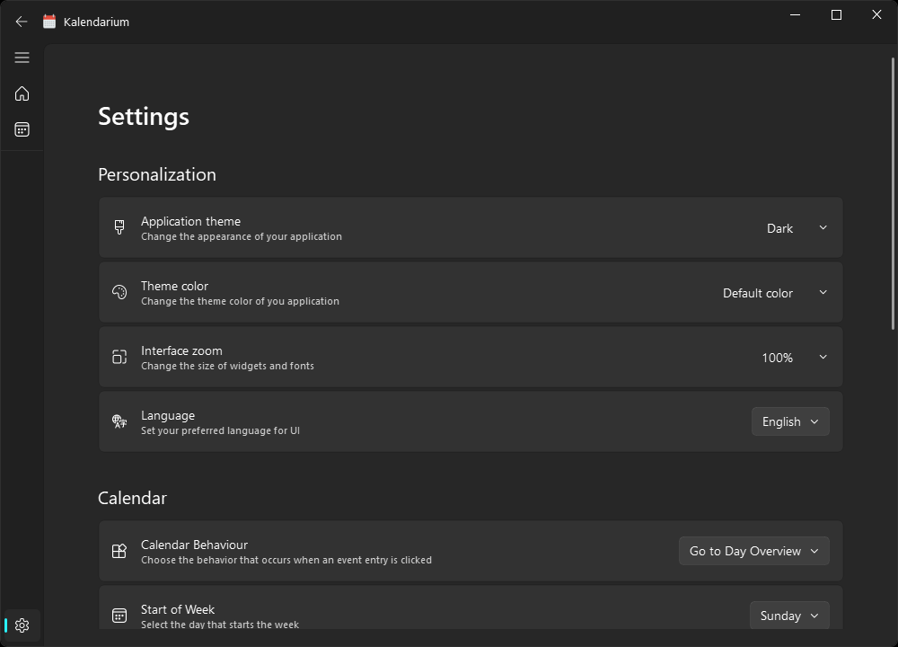

# Kalendarium

A simple calendar app using PySide6 and [QFluentWidgets](https://qfluentwidgets.com/)

## Purpose

I wanted to learn more about PySide6/PyQt and create a simple app with a very limited number of features, but enough to meet my personal needs.

## Features

* Weather Forecast
* Custom colors for each event's reminder

## WeatherAPI

To enable the weather feature, you need a valid access token from [WeatherAPI.com](https://www.weatherapi.com/).

Create a free account to obtain an access token. Kalendarium stores the forecast in the database and only attempts to fetch new data every hour, so you will never reach the maximum quota.

## Screenshots






## Translation

If you want to localize the app to your language, translate the `.ts` file located at:

    src/resource/i18n/general.en_US.ts

Then, add the option to `src/config/config.py`.

#### Convert .ts to .qm
To use `lrelease.exe`, which is located at `\Lib\site-packages\PySide6\lrelease.exe`, follow these steps:

1. Open your command prompt
2. Navigate to the PySide6 directory:

```markfile
    C:\..\PySide6>
```
3. Run the following command:

```markfile
    lrelease general.en_US.ts
```
This will generate a file named `general.en_US.qm`.


## Build .EXE executable

Instructions to run PyInstaller

1. Ensure PyInstaller is Installed
    If you haven’t already installed PyInstaller, you can do so using pip:
```
    pip install pyinstaller
```

2. Open Your Command Prompt or Terminal
Navigate to the directory where your `app.spec` file is located.

3. Run PyInstaller with the Spec File
Use the following command to build your application:
```
    pyinstaller app.spec
```

4. Locate the Output
After running the command, PyInstaller will create several folders, including `dist`, `build`, and a `__pycache__` folder. Your executable will be located in the `dist` folder.

5. Run Your Application
Navigate to the `dist` folder and you will find your executable file. You can run it directly from there.

## Resources

QFluentWidgets - https://qfluentwidgets.com

WeatherAPI - https://www.weatherapi.com/


## License ##

[](https://creativecommons.org/publicdomain/zero/1.0/)

This project is in the worldwide [public domain](LICENSE).

This project is in the public domain and copyright and related rights in the work worldwide are waived through the [CC0 1.0 Universal public domain dedication](https://creativecommons.org/publicdomain/zero/1.0/).

All contributions to this project will be released under the CC0 dedication. By submitting a pull request, you are agreeing to comply with this waiver of copyright interest.